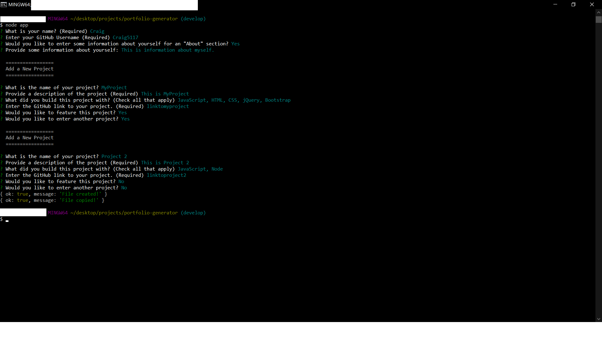
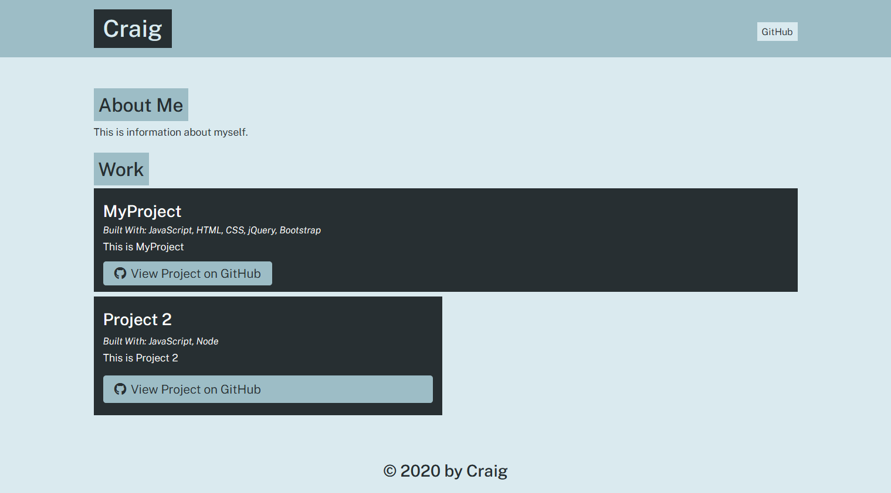

# portfolio-generator

## Purpose
A node app that generates a portfolio based on user input.
### Table of Contents
- [Built With](#built-with)
- [Resources](#resources)
- [Setup](#setup)
- [Usage](#usage)
- [Contribution](#contribution)
    - [Author Contact Info](#author-contact-info)

---
## Built With
- JavaScript
- HTML

[Back to Contents](#table-of-contents)

---
## Resources
- [Font Awesome](https://fontawesome.com/) (https://cdnjs.cloudflare.com/ajax/libs/font-awesome/5.11.2/css/all.min.css)
- Google Fonts

[Back to Contents](#table-of-contents)

---
## Setup

Clone this repo to a directory on your machine.

[Back to Contents](#table-of-contents)

---
## Usage

After you clone this repo, go to its root directory and run npm install to install its dependencies.

Once the dependencies are installed, you can run node app in the CLI to start the application. You will then be prompted for input including your name, GitHub username, and some information about yourself (about is optional). After completing the initial prompt for your info, you will be prompted for info on your GitHub projects. Supply the project name, description, languages, and link. Choose whether to feature the project, and choose whether to enter another projects. When you are done, a website with your portfolio will be genearated to the dist directory.

[Back to Contents](#table-of-contents)

---

## Contribution

**Craig Bennett**
### Author Contact Info:

GitHub: https://github.com/Craig5117

LinkedIn: https://www.linkedin.com/in/craig-bennett-852a571b4/

[Back to Contents](#table-of-contents)

